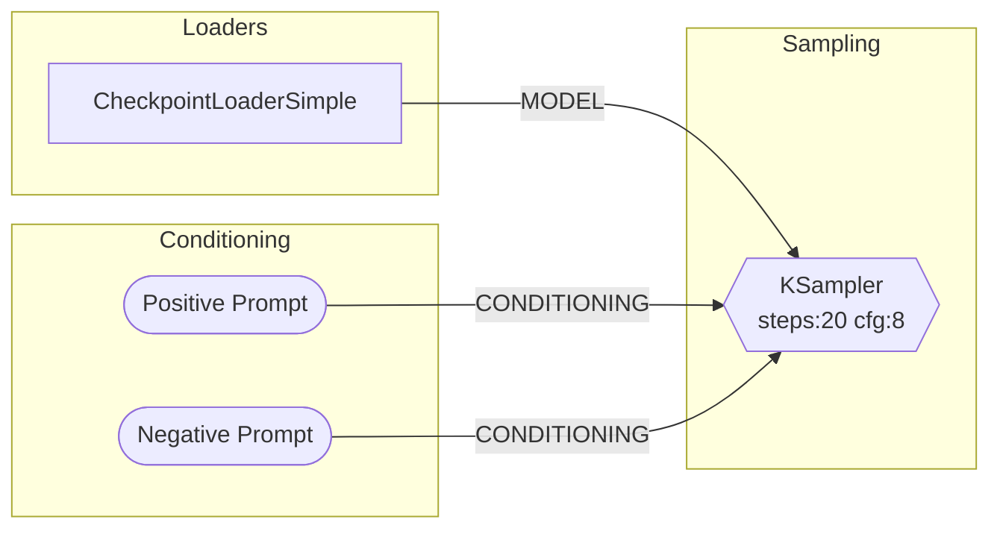

# comfyui-mcp

**MCP server + Claude Code plugin for [ComfyUI](https://github.com/comfyanonymous/ComfyUI)** — execute workflows, generate images, visualize pipelines, manage models, control VRAM, and explore custom nodes, all from your AI coding assistant.

[](https://www.npmjs.com/package/comfyui-mcp)
[](https://nodejs.org)
[](./LICENSE)

Works on **macOS**, **Linux**, and **Windows**. Auto-detects your ComfyUI installation and port.

**30 MCP tools** | **10 slash commands** | **4 knowledge skills** | **3 autonomous agents** | **3 hooks**

---

## Quick Start

**1. Install ComfyUI** (if you haven't already): [ComfyUI Desktop](https://www.comfy.org/download) or [from source](https://github.com/comfyanonymous/ComfyUI)

**2. Add the MCP server** to your Claude Code config (`~/.claude/settings.json`):

```json
{
  "mcpServers": {
    "comfyui": {
      "command": "npx",
      "args": ["-y", "comfyui-mcp"],
      "env": {
        "CIVITAI_API_TOKEN": ""
      }
    }
  }
}
```

**3. Start using it.** With ComfyUI running, ask Claude to generate an image:

```
> Generate an image of a sunset over mountains
```

Claude will find (or download) a checkpoint, build a workflow, execute it, and return the image.

> **Note**: This runs as a standalone MCP server — no need to clone this repo. `npx` will download and run it automatically.

---

## Claude Code Plugin

This package also ships as a **Claude Code plugin**, providing slash commands, skills, agents, and hooks on top of the MCP tools.

### Install as a plugin

```bash
claude plugin install comfyui-mcp
```

### Slash commands

| Command | Description |
|---------|-------------|
| `/comfy:gen <prompt>` | Generate an image from a text description — auto-selects checkpoint, builds workflow, returns image |
| `/comfy:viz <workflow>` | Visualize a workflow as a Mermaid diagram with nodes grouped by category |
| `/comfy:node-skill <pack>` | Generate a Claude skill for a custom node pack from Registry ID or GitHub URL |
| `/comfy:debug [prompt_id]` | Diagnose why a workflow failed — reads history, logs, traces root cause, suggests fixes |
| `/comfy:batch <prompt, params>` | Parameter sweep generation across cfg, sampler, steps, seed, etc. |
| `/comfy:convert <file>` | Convert between UI format and API format workflows |
| `/comfy:install <pack>` | Install a custom node pack — git clone, pip install, optional restart |
| `/comfy:gallery [filter]` | Browse generated outputs with metadata — filter by date, count, or filename |
| `/comfy:compare <a vs b>` | Diff two workflows side by side — shows added/removed nodes and changed parameters |
| `/comfy:recipe <name> <prompt>` | Multi-step recipes: `portrait`, `hires-fix`, `style-transfer`, `product-shot` |

### Built-in skills

| Skill | Description |
|-------|-------------|
| **comfyui-core** | Workflow format, node types, data flow patterns, pipeline architecture, MCP tool usage guide |
| **prompt-engineering** | CLIP weight syntax `(word:1.3)`, BREAK tokens, embeddings, model-specific prompting for SD1.5/SDXL/Flux/SD3 |
| **troubleshooting** | Common error catalog — OOM, dtype mismatches, missing nodes, NaN tensors, black images, CUDA errors, with VRAM estimates per model |
| **model-compatibility** | Compatibility matrix — loaders, resolutions, CFG, samplers, ControlNets, LoRAs, and VAEs per model family (SD1.5/SDXL/Turbo/Lightning/Flux/SD3/LTXV) |

### Agents

| Agent | Model | Description |
|-------|-------|-------------|
| **comfy-explorer** | Sonnet | Researches custom node packs — reads docs, queries `/object_info`, generates comprehensive skill files |
| **comfy-debugger** | Sonnet | Autonomously diagnoses workflow failures — gathers logs + history, identifies failing node, checks models + custom nodes, proposes and optionally applies fixes |
| **comfy-optimizer** | Sonnet | Analyzes workflows for performance — detects redundant nodes, VRAM waste, wrong CFG/steps for model family, precision issues, suggests optimizations |

### Hooks

| Event | Trigger | Action |
|-------|---------|--------|
| PreToolUse | `run_workflow` | **VRAM watchdog** — checks GPU memory via `/system_stats` and warns if < 1GB free before execution |
| PreToolUse | `stop_comfyui`, `restart_comfyui` | **Save warning** — prompts user to save unsaved workflow changes before stopping ComfyUI |
| PostToolUse | `run_workflow` | **Auto-open image** — finds the newest output image and opens it in your system viewer |

---

## MCP Tools

30 tools organized into 12 categories:

### Workflow Execution

| Tool | Description |
|------|-------------|
| `run_workflow` | Execute a workflow (API format JSON), returns images as base64 |
| `get_job_status` | Check execution status of a running job by prompt ID |
| `get_queue` | View the current execution queue (running + pending) |
| `cancel_job` | Interrupt the currently running job |
| `get_system_stats` | Get system info — GPU, VRAM, Python version, OS |

### Workflow Visualization

| Tool | Description |
|------|-------------|
| `visualize_workflow` | Convert a workflow to a Mermaid flowchart with nodes grouped by category |
| `mermaid_to_workflow` | Convert a Mermaid diagram back to executable workflow JSON |

### Workflow Composition

| Tool | Description |
|------|-------------|
| `create_workflow` | Generate a workflow from templates: `txt2img`, `img2img`, `upscale`, `inpaint` |
| `modify_workflow` | Apply operations: `set_input`, `add_node`, `remove_node`, `connect`, `insert_between` |
| `get_node_info` | Query available node types from ComfyUI's `/object_info` endpoint |

### Workflow Validation

| Tool | Description |
|------|-------------|
| `validate_workflow` | Dry-run validation — checks missing nodes, broken connections, invalid output indices, missing model files |

### Workflow Library

| Tool | Description |
|------|-------------|
| `list_workflows` | List saved workflows from ComfyUI's user library |
| `get_workflow` | Load a specific saved workflow by filename |
| `save_workflow` | Save a workflow to the ComfyUI user library |

### Image Management

| Tool | Description |
|------|-------------|
| `upload_image` | Copy a local image into ComfyUI's `input/` directory for img2img, inpaint, or ControlNet |
| `workflow_from_image` | Extract embedded workflow metadata from a ComfyUI-generated PNG (reads `prompt` and `workflow` tEXt chunks) |
| `list_output_images` | Browse recently generated images from the output directory, sorted newest-first |

### Model Management

| Tool | Description |
|------|-------------|
| `search_models` | Search HuggingFace for compatible models (checkpoints, LoRAs, VAEs, etc.) |
| `download_model` | Download a model from a URL to the correct ComfyUI subdirectory |
| `list_local_models` | List installed models by type: checkpoints, loras, vae, upscale_models, controlnet, embeddings, clip, unet |

### Memory Management

| Tool | Description |
|------|-------------|
| `clear_vram` | Free GPU VRAM by unloading cached models — calls ComfyUI's `/free` endpoint, reports before/after stats |
| `get_embeddings` | List installed textual inversion embeddings |

### Registry & Discovery

| Tool | Description |
|------|-------------|
| `search_custom_nodes` | Search the ComfyUI Registry for custom node packs by keyword |
| `get_node_pack_details` | Get full details of a custom node pack (description, author, nodes, install info) |
| `generate_node_skill` | Generate a Claude skill `.md` file from a Registry ID or GitHub URL |

### Diagnostics

| Tool | Description |
|------|-------------|
| `get_logs` | Get ComfyUI server logs with optional keyword filter (e.g., `error`, `warning`, a node name) |
| `get_history` | Get execution history with full error details, Python tracebacks, timing, and cached node info |

### Process Control

| Tool | Description |
|------|-------------|
| `stop_comfyui` | Stop the running ComfyUI process (saves PID and launch args for restart) |
| `start_comfyui` | Start ComfyUI using info saved from a previous stop |
| `restart_comfyui` | Stop and restart ComfyUI, preserving all launch arguments |

---

## Examples

### Generate an image

```
> /comfy:gen a cyberpunk city at night with neon lights
```

Claude will:
1. Check installed checkpoints (download one if needed)
2. Build a txt2img workflow with your prompt
3. Execute it on ComfyUI
4. Return the generated image

### Visualize a workflow

```
> /comfy:viz ~/workflows/my-workflow.json
```

Produces a Mermaid diagram with nodes grouped by category:



### Debug a failed workflow

```
> /comfy:debug
```

Automatically reads the last execution history and logs, identifies the failing node, checks for missing models or node packs, and suggests a fix.

```
> /comfy:debug abc123-def456
```

Diagnose a specific execution by prompt ID.

### Parameter sweep

```
> /comfy:batch a cat in a field, cfg:5-10:2, sampler:euler,dpmpp_2m
```

Generates a grid of images across all parameter combinations and presents a summary table with results.

Supported sweep parameters: `cfg`, `steps`, `sampler`, `scheduler`, `seed`, `denoise`, `width`, `height`.

### Multi-step recipes

```
> /comfy:recipe hires-fix a dramatic fantasy landscape with castles
```

Runs a two-pass pipeline: txt2img at 512x768, then img2img upscale to 1024x1536 with detail enhancement.

Available recipes:

| Recipe | Description |
|--------|-------------|
| `portrait` | Generate at 1024x1024, then 2x upscale to 2048x2048 |
| `hires-fix` | Low-res generation → img2img upscale with denoise 0.4-0.5 |
| `style-transfer` | Apply a style prompt to an existing image via img2img |
| `product-shot` | Product image with clean white background |

### Convert workflow format

```
> /comfy:convert ~/workflows/my-ui-workflow.json
```

Converts between ComfyUI's UI format (nodes + links arrays) and API format (node IDs → {class_type, inputs}).

### Install a custom node pack

```
> /comfy:install comfyui-impact-pack
```

Searches the registry, shows details, clones the repo to `custom_nodes/`, installs dependencies, and offers to restart ComfyUI.

### Browse output gallery

```
> /comfy:gallery last 5
> /comfy:gallery today
```

Lists recent outputs with embedded metadata — shows checkpoint, prompt, seed, steps, CFG, sampler for each image.

### Compare workflows

```
> /comfy:compare workflow-a.json vs workflow-b.json
```

Shows added/removed nodes, changed parameters (old → new values), and optional Mermaid diagrams for visual comparison.

### Validate before running

```
> Validate this workflow before I run it
```

Checks for missing node types, broken connections, invalid output indices, and missing model files — without executing.

### Manage models

```
> What checkpoints do I have installed?
> Search HuggingFace for SDXL turbo models
> Download this model to my checkpoints folder
```

### Manage VRAM

```
> Free my VRAM
> What embeddings do I have?
```

### Extract workflow from an image

```
> Extract the workflow from this image: ~/outputs/ComfyUI_00042_.png
```

Reads the PNG metadata chunks to recover the exact workflow and prompt used to generate the image.

### Explore custom nodes

```
> /comfy:node-skill comfyui-impact-pack
```

Generates a comprehensive skill file documenting every node, its inputs/outputs, and usage patterns.

### Process control

```
> Restart ComfyUI
> Stop ComfyUI
> Start ComfyUI back up
```

---

## Configuration

The server auto-detects your ComfyUI installation and port. Override with environment variables if needed:

| Variable | Default | Description |
|----------|---------|-------------|
| `COMFYUI_HOST` | `127.0.0.1` | ComfyUI server address |
| `COMFYUI_PORT` | *(auto-detect)* | ComfyUI server port (tries 8188, then 8000) |
| `COMFYUI_PATH` | *(auto-detect)* | Path to ComfyUI data directory |
| `CIVITAI_API_TOKEN` | | CivitAI API token for model downloads |
| `HUGGINGFACE_TOKEN` | | HuggingFace token for higher API rate limits |
| `GITHUB_TOKEN` | | GitHub token for skill generation (avoids rate limits) |
| `LOG_LEVEL` | `info` | Logging verbosity: `debug`, `info`, `warn`, `error` |

### Auto-detection

**Port**: Probes `8188` (CLI default) then `8000` (Desktop app default) via `/system_stats`.

**Path**: Checks common locations in order:

- `~/Documents/ComfyUI` (macOS/Windows Desktop app data directory)
- `~/Library/Application Support/ComfyUI` (macOS)
- `~/AppData/Local/Programs/ComfyUI/resources/ComfyUI` (Windows Desktop app install)
- `~/AppData/Local/ComfyUI` (Windows)
- `~/ComfyUI`, `~/code/ComfyUI`, `~/projects/ComfyUI`, `~/src/ComfyUI`
- `/opt/ComfyUI`, `~/.local/share/ComfyUI` (Linux)
- Scans `~/Documents` and `~/My Documents` for any directory containing "ComfyUI"

Set `COMFYUI_PATH` to skip detection and use an explicit path.

---

## How It Works

The server communicates with ComfyUI through its REST API and WebSocket interface:

- **WebSocket** — enqueue workflows, receive real-time progress updates, get execution results
- **REST API** — system stats, node definitions (`/object_info`), logs, history, queue management, workflow library, VRAM control (`/free`), embeddings
- **File system** — read/write models directory, detect installation paths, upload images, extract PNG metadata, browse outputs
- **External APIs** — HuggingFace (model search), ComfyUI Registry (custom node discovery), GitHub (skill generation), CivitAI (model downloads)

All communication with the MCP client (Claude Code) happens over **stdio** using the [Model Context Protocol](https://modelcontextprotocol.io). Logs go to stderr to avoid polluting the protocol stream.

---

## Development

### Prerequisites

- [Node.js](https://nodejs.org) >= 22.0.0
- [ComfyUI](https://github.com/comfyanonymous/ComfyUI) running locally

### Setup

```bash
git clone https://github.com/artokun/comfyui-mcp.git
cd comfyui-mcp
npm install
```

### Scripts

| Script | Description |
|--------|-------------|
| `npm run dev` | Run from source with tsx (hot reload) |
| `npm run build` | Compile TypeScript to `dist/` |
| `npm start` | Run compiled output |
| `npm test` | Run unit tests (vitest) |
| `npm run test:integration` | Run integration tests (requires running ComfyUI) |
| `npm run lint` | Type-check without emitting |

### Local testing with Claude Code

Point Claude Code at your local build instead of the npm package:

```json
{
  "mcpServers": {
    "comfyui": {
      "command": "node",
      "args": ["/path/to/comfyui-mcp/dist/index.js"],
      "env": {}
    }
  }
}
```

Or test the plugin directly:

```bash
claude --plugin-dir ./plugin
```

### Project structure

```
src/
  index.ts                 # MCP server entry point (stdio transport)
  config.ts                # Auto-detection & environment config
  comfyui/
    client.ts              # ComfyUI WebSocket/HTTP client wrapper
    types.ts               # TypeScript interfaces
  services/
    workflow-executor.ts   # Execute workflows, handle images & errors
    workflow-composer.ts   # Templates (txt2img, img2img, upscale, inpaint)
    workflow-validator.ts  # Dry-run validation (missing nodes, models, connections)
    image-management.ts    # Upload images, extract PNG metadata, list outputs
    mermaid-converter.ts   # Workflow → Mermaid diagram
    mermaid-parser.ts      # Mermaid diagram → Workflow
    model-resolver.ts      # HuggingFace search, local models, downloads
    process-control.ts     # Stop, start, restart ComfyUI process
    registry-client.ts     # ComfyUI Registry API
    skill-generator.ts     # Generate node pack skill docs
  tools/                   # MCP tool registration (one file per group)
    workflow-execute.ts    # run_workflow, get_job_status, get_queue, cancel_job, get_system_stats
    workflow-visualize.ts  # visualize_workflow, mermaid_to_workflow
    workflow-compose.ts    # create_workflow, modify_workflow, get_node_info
    workflow-validate.ts   # validate_workflow
    workflow-library.ts    # list_workflows, get_workflow, save_workflow
    image-management.ts    # upload_image, workflow_from_image, list_output_images
    model-management.ts    # search_models, download_model, list_local_models
    memory-management.ts   # clear_vram, get_embeddings
    registry-search.ts     # search_custom_nodes, get_node_pack_details
    skill-generator.ts     # generate_node_skill
    diagnostics.ts         # get_logs, get_history
    process-control.ts     # stop_comfyui, start_comfyui, restart_comfyui
    index.ts               # Registers all tool groups
  utils/
    errors.ts              # Custom error hierarchy with MCP integration
    logger.ts              # stderr-only logging (safe for stdio transport)
    image.ts               # Base64 encoding utilities
plugin/
  .claude-plugin/          # Plugin manifest
  .mcp.json                # MCP server config for plugin
  commands/                # Slash commands
    gen.md                 # /comfy:gen — image generation
    viz.md                 # /comfy:viz — workflow visualization
    node-skill.md          # /comfy:node-skill — skill generation
    debug.md               # /comfy:debug — failure diagnosis
    batch.md               # /comfy:batch — parameter sweeps
    convert.md             # /comfy:convert — format conversion
    install.md             # /comfy:install — node pack installation
    gallery.md             # /comfy:gallery — output browser
    compare.md             # /comfy:compare — workflow diff
    recipe.md              # /comfy:recipe — multi-step pipelines
  skills/                  # Knowledge bases
    comfyui-core/          # Workflow format, node types, pipeline patterns
    prompt-engineering/    # CLIP syntax, model-specific prompting
    troubleshooting/       # Error catalog with patterns and fixes
    model-compatibility/   # Compatibility matrix per model family
  agents/                  # Autonomous agents
    explorer.md            # Research custom node packs, generate skills
    debugger.md            # Diagnose workflow failures
    optimizer.md           # Analyze and optimize workflows
  hooks/                   # Pre/post tool-use hooks
    hooks.json             # Hook configuration
    vram-check.mjs         # VRAM watchdog before execution
    save-warning.mjs       # Save prompt before stop/restart
    open-latest-image.mjs  # Auto-open generated images
```

---

## Troubleshooting

**"ComfyUI not detected on ports 8188, 8000"**
Make sure ComfyUI is running. The Desktop app uses port 8000 by default; the CLI uses 8188. Set `COMFYUI_PORT` if you're using a custom port.

**"COMFYUI_PATH is not configured"**
The auto-detection couldn't find your ComfyUI data directory. Set `COMFYUI_PATH` to the directory containing your `models/` folder (e.g., `~/Documents/ComfyUI`).

**"Multiple ComfyUI installations detected"**
This is informational — the server uses the first one found. Set `COMFYUI_PATH` to pick a specific installation.

**Model downloads fail**
For HuggingFace gated models, set `HUGGINGFACE_TOKEN`. For CivitAI, set `CIVITAI_API_TOKEN`.

**Workflow execution errors**
Use `/comfy:debug` to automatically diagnose failures. Or use `get_history` / `get_logs` directly to see detailed error messages including Python tracebacks from ComfyUI.

**Out of memory (OOM)**
Use `clear_vram` to free GPU memory before running large workflows. The VRAM watchdog hook will warn you automatically if memory is critically low. See the **troubleshooting** skill for model-specific VRAM estimates.

**Missing custom nodes**
Use `/comfy:install <pack>` to install missing node packs from the registry. The debug command will detect and suggest missing packs automatically.

---

## Contributing

1. Fork the repository
2. Create a feature branch (`git checkout -b feat/my-feature`)
3. Make your changes and ensure `npm run lint` passes
4. Submit a pull request

---

## License

MIT — see [LICENSE](./LICENSE) for details.
