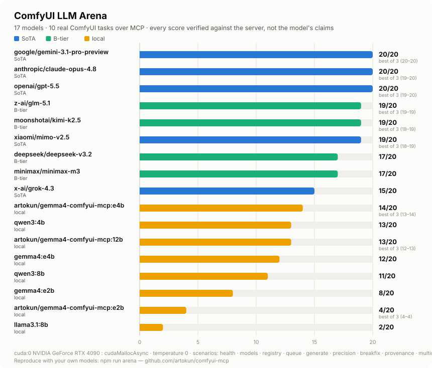
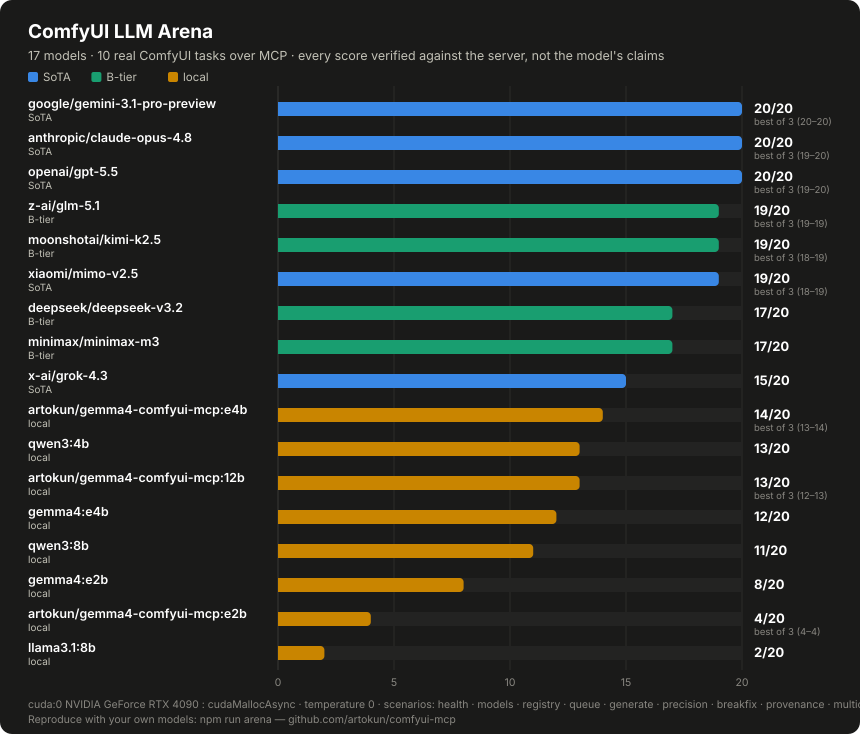

The **ComfyUI LLM Arena** answers one question honestly: *can this model
actually drive ComfyUI?* Not "does it sound confident" — every scenario's
outcome is **verified against the ComfyUI server itself** (job history,
executed graph parameters, real output files and their pixel sizes). It runs
over the same [compact tool-router](./local-llms) the panel and MCP clients
use, so an arena score predicts real agent behavior.

```bash
npm run arena          # scores the default local field via Ollama
```

## The task ladder

Ten scenarios, three difficulty bands, PASS = 2 (done & server-verified),
PARTIAL = 1 (right tool family, incomplete outcome), FAIL = 0 — max **20**:

| Band | Scenario | What it proves |
| --- | --- | --- |
| Basics | `health` · `models` · `registry` · `queue` | tool discovery + single-call tasks |
| Gauntlet | `generate` (async render + polling) · `precision` (exact steps/size land in the executed graph) · `breakfix` (deliberate failure → diagnose → recover) · `provenance` (find the asset registry, re-render it via generate_image (action:"regenerate") with an override) | multi-hop chains, parameter fidelity, error recovery |
| Crucible | `multiout` (ONE graph saving 512px + 1024px outputs — verified by reading the PNG headers) · `pipeline` (two-stage img2img chained through `upload_image (action:"stage")`) | raw graph composition — no template covers these |

Ties break on **nudges → tool rounds → wall time**, so a model that nails a
task first-try outranks one that flailed to the same score.

## Bring your own model

The arena speaks two dialects — local Ollama and anything OpenAI-compatible:

```bash
# Local models (Ollama)
ARENA_MODELS="gemma4:e4b,qwen3:4b" npm run arena

# Any hosted model — one OpenRouter key covers most of the market
ARENA_API=openai ARENA_BASE_URL=https://openrouter.ai/api/v1 \
ARENA_API_KEY=sk-or-... ARENA_TIER=B-tier \
ARENA_MODELS="deepseek/deepseek-v3.2,z-ai/glm-5.1,xiaomi/mimo-v2.5" \
npm run arena

# Direct providers work too (any /v1/chat/completions endpoint):
#   DeepSeek:  ARENA_BASE_URL=https://api.deepseek.com/v1
#   vLLM/LM Studio: point ARENA_BASE_URL at your server
```

Results **merge across invocations** (run one model at a time if you like) into
`arena-results/`: a JSON, full per-scenario transcripts, and a share-ready
`arena-report.md`. Generate the leaderboard graphic with:

```bash
node scripts/arena-graphic.mjs    # light + dark SVGs from your own results
```

Useful knobs: `ARENA_TIER` labels a run's models (SoTA / B-tier / local);
`ARENA_OUT` redirects output; `ARENA_MAX_ROUNDS` and
`ARENA_SCENARIO_TIMEOUT_MS` bound runaway models;
`COMFYUI_DEFAULT_CHECKPOINT` pins the render checkpoint (do this if your
checkpoints folder leads with a non-txt2img model).

**Requirements**: a running ComfyUI with a txt2img checkpoint (SD 1.5 is
plenty — scenarios are verified on content, not quality), `npm run build`
once, and either Ollama or an API key.

## What every run records

Beyond the score, each leaderboard entry carries the axes that make a result
actionable (#792):

- **Quantization and parameter size** (Ollama `/api/show`) and **resident
  VRAM** (`/api/ps`, sampled while the model is still loaded) — so "what can my
  8 GB card actually run, and is a q4 good enough?" is answerable from the
  table. Running the same model at q4 / q8 / fp16 through the ladder shows
  where the score actually falls off. These fields are blank when the probe
  can't answer (hosted endpoints have no equivalent) — never guessed.
- **The comfyui-mcp version**, stamped on every entry whose run could read it
  (a run that can't read its own package version is recorded *unversioned*,
  exactly like a pre-stamping run). Absolute scores move when the tool surface
  changes, so the report flags any leaderboard that mixes versions (or
  unversioned runs) as **not directly comparable**.
- **Every tool the model reached for** on a failure, not just the ones that
  succeeded. When 2+ models fail the same scenario after selecting the same
  wrong tool (and no passing run used it), the report flags a **suspect
  scenario** — a field-wide wrong selection is a tool-*description* suspect,
  not a capability gap (precedent: #557/#654, where our own wording, not the
  models, was wrong). Check the description before trusting that scenario's
  scores.

## Current leaderboard




Consultable without running the ladder. Resident VRAM is the model's footprint while it is loaded (Ollama `/api/ps`), not remaining headroom — ComfyUI shares the same card. Params/Quant come from `/api/show`. Hosted endpoints have no equivalent; those cells stay `—`, never guessed.

These runs were recorded before version stamping (or could not read their package version). Absolute scores move when the tool surface changes — do not compare them to a current-surface run as if they were one ladder.

Hardware: cuda:0 NVIDIA GeForce RTX 4090 : cudaMallocAsync.

Published 4090 leaderboard (`docs/images/arena-leaderboard-*.svg`, recorded 2026-07-09). These runs predate version stamping and the 0.50 tool-surface consolidation (#726); VRAM and quantization were not probed, so those cells stay em-dash rather than guessed. Absolute scores are not comparable to a current-surface run.

**VRAM not recorded — hosted models, or runs from before the VRAM axis**

| Model | Tier | Params | Quant | VRAM | Score |
| --- | --- | --- | --- | --- | --- |
| `google/gemini-3.1-pro-preview` | SoTA | — | — | — | 20/20 |
| `anthropic/claude-opus-4.8` | SoTA | — | — | — | 20/20 |
| `openai/gpt-5.5` | SoTA | — | — | — | 20/20 |
| `z-ai/glm-5.1` | B-tier | — | — | — | 19/20 |
| `moonshotai/kimi-k2.5` | B-tier | — | — | — | 19/20 |
| `xiaomi/mimo-v2.5` | SoTA | — | — | — | 19/20 |
| `deepseek/deepseek-v3.2` | B-tier | — | — | — | 17/20 |
| `minimax/minimax-m3` | B-tier | — | — | — | 17/20 |
| `x-ai/grok-4.3` | SoTA | — | — | — | 15/20 |
| `artokun/gemma4-comfyui-mcp:e4b` | local | — | — | — | 14/20 |
| `qwen3:4b` | local | — | — | — | 13/20 |
| `artokun/gemma4-comfyui-mcp:12b` | local | — | — | — | 13/20 |
| `gemma4:e4b` | local | — | — | — | 12/20 |
| `qwen3:8b` | local | — | — | — | 11/20 |
| `gemma4:e2b` | local | — | — | — | 8/20 |
| `artokun/gemma4-comfyui-mcp:e2b` | local | — | — | — | 4/20 |
| `llama3.1:8b` | local | — | — | — | 2/20 |

Replace `benchmarks/arena-baseline.json` with a current-surface `arena-results.json` and re-run `node scripts/arena-baseline.mjs` to refresh this table. A run that recorded resident VRAM groups itself into **Fits 8 GB**.

17 models, best-of-3 on the top cluster. The headline findings:

- **gemini-3.1-pro-preview is the only model that's perfect every run** (20-20-20).
- claude-opus-4.8 and gpt-5.5 both reach 20 but dropped a point in other runs.
- **The B-tier is one point off the frontier** — GLM-5.1 (19-19-19, steadiest
  model in the field), Kimi-k2.5 and MiMo-v2.5 at 19 — at a small fraction of
  frontier pricing.
- Small local models clear the basics and parts of the gauntlet but stall on
  the crucible's graph composition; llama3.1:8b can't hold the tool format at
  all.

We'd love community runs of models we haven't covered — post your
`arena-report.md` (and graphic) in a
[GitHub discussion](https://github.com/artokun/comfyui-mcp/discussions) or
issue, with your GPU + model tags so results are comparable.

## Panel smoke test

An arena score proves headless tool-driving; `npm run smoke:panel` proves the
same model survives the **live sidebar panel** (streaming, turn-gating, the
6-tool router over the bridge). It spawns an isolated orchestrator per model
on its own port and drives one real turn:

```bash
SMOKE_MODELS="gemma4:e4b,xiaomi/mimo-v2.5" npm run smoke:panel
```
